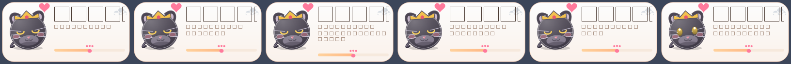

# CatClock 🐱

桌面可爱猫猫 · 下班倒计时挂件（Windows，PyQt6）。

类似 Catime 的桌面悬浮小窗：多只猫猫 + 多套主题，支持拖动、托盘、开机自启、置顶。



- 当前版本：`1.1.0`
- 下载地址：<https://github.com/Xingsenya/CatClock/releases>（打 tag 后由 GitHub Actions 自动打包发布）
- 建库与发版流程：见 [GITHUB_SETUP.md](GITHUB_SETUP.md)

## 功能

- **倒计时**：上班前 / 工作中（进度条）/ 下班后 / 休息日（每周可配，适配单休轮休）
- **21 个角色**：橘猫、奶牛猫、黑猫、三花猫、白猫、蓝猫、暹罗猫、虎斑猫、熊猫 + 十二生肖
- **5 套主题**：奶油、草莓、薄荷、夜幕、柠檬
- **天气**：Open-Meteo 免费接口（免 key），城市支持逐级降级匹配（区县名也能查）；雷暴/酷暑/严寒猫有对应反应；新增空气质量提示
- **分组设置窗口**：右键「设置…」打开，外观 / 时间 / 通知 / 天气 / 智能 / 高级六个标签页，替代原先长菜单
- **帽子 & 配饰**：7 款常规帽子 + 圣诞帽/福帽/巫师帽（节日自动）；圆眼镜/墨镜/耳机/领结
- **动画关键帧**：待机动作（伸懒腰/打哈欠/挥手/摇尾 + 打喷嚏/追尾巴）带缓动；静止时自动降频省电
- **语录自定义**：`%APPDATA%\CatClock\quotes.json` 可自行覆盖时段/周五/天气/久坐文案
- **工作统计**：在岗/加班时长，支持导出 CSV
- **周报与成就**：平均下班时间、最拼的一天、加班汇总 + 8 枚成就徽章
- **更新检查**：启动时静默检测 GitHub Release
- **情境感知**：识别前台应用与全屏状态（开会/写代码/做表格/写文档/做 PPT/浏览器/聊天/设计/看视频/打游戏）、忙碌度（键鼠活跃度）、电量与 CPU，猫会按你在干什么换台词
- **节日皮肤**：元旦/春节/元宵/情人节/清明/五一/端午/中秋/国庆/万圣/圣诞/跨年自动换帽子、道具和问候（农历节日内置 2026-2030 对照表）
- **心情打卡**：双击猫头记录「累/还行/开心」，生成近 14 天情绪曲线与洞察（哪天最容易累）
- **老板键 & 边缘吸附**：Ctrl+Alt+H 一键隐身；拖到屏幕边缘自动收纳，鼠标移入再滑出
- **情绪价值**：发工资倒计时、打工人语录轮播（周五专属 + 天气联动）、随机小惊喜（打喷嚏/追尾巴/掉金币/送爱心）、瞳孔跟随鼠标、摇尾巴、摸猫彩蛋、整点报时（7-22 点防打扰）、久坐提醒（人不在不打扰）、深夜关怀、休息日前夜提示
- **智能感知**：人离开 3 分钟猫打瞌睡（Zzz），回来主动打招呼；下班前 30/10 分钟预告、上班前 10 分钟提醒、到点通知均可开关
- **交互**：右键菜单高频项 + 设置入口、滚轮等比缩放（60%–160%）、迷你模式、单实例锁、多屏拖动

## 使用

从 [Releases](https://github.com/Xingsenya/CatClock/releases) 下载 `CatClock-vX.Y.Z.exe`，双击运行即可，无需安装。右键托盘/窗口打开菜单。

挂件启动时静默检查更新，有新版本会在菜单里提示。

开发：

```bash
pip install PyQt6
python cat_clock.py        # 源码运行
python preview_all.py      # 渲染 角色×主题 预览图 preview.png
python hats_preview.py     # 渲染所有帽子预览图 preview_hats.png
python tools/smoke.py      # 一键冒烟：编译检查 + 渲染 preview_states.png
python tools/smoke.py --exe  # 额外拉起 dist/CatClock.exe 跑 15 秒再关掉
python tools/publish.py    # 提交 → 推 main → 打版本 tag → 触发 CI 发 Release
```

打包：`pyinstaller CatClock.spec`（已配置 onefile + icon + catclock 包）

## 配置

存于 `%APPDATA%\CatClock\config.json`，菜单里所有改动自动记忆。同目录其它文件：

| 文件 | 用途 |
|---|---|
| `quotes.json` | 自定义语录（时段 / 周五 / 天气 / 久坐 / 情境），可随意编辑 |
| `work_stats.json` | 逐日在岗与加班时长 |
| `mood.json` | 每天的心情打卡记录 |
| `qwen.json` | 可选：Qwen API Key，开启后每天生成一组个性化语录（离线自动回退内置池） |
